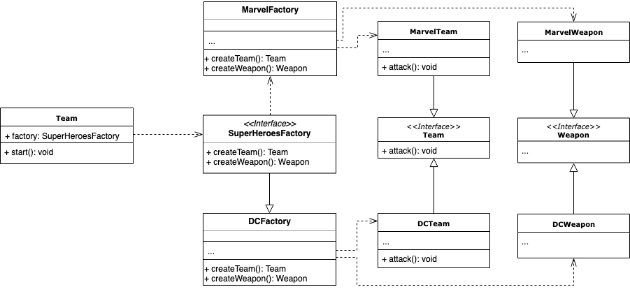

# Abstract factory
Abstract Factory is a creational design pattern that lets you produce families of related objects without specifying their concrete classes [(source)](https://refactoring.guru/design-patterns/abstract-factory).

