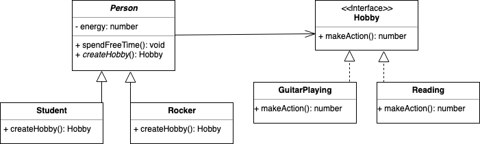

# Factory method
Factory Method is a creational design pattern that provides an interface for creating objects in a superclass, but allows subclasses to alter the type of objects that will be created [(source)]((https://refactoring.guru/en/design-patterns/factory-method)).

